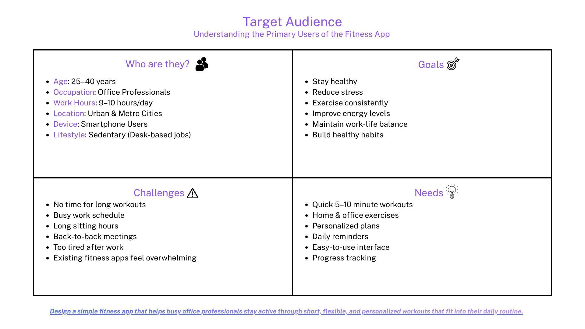
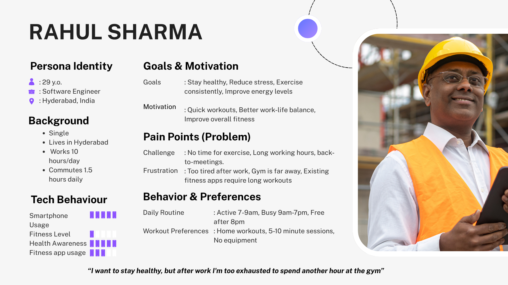
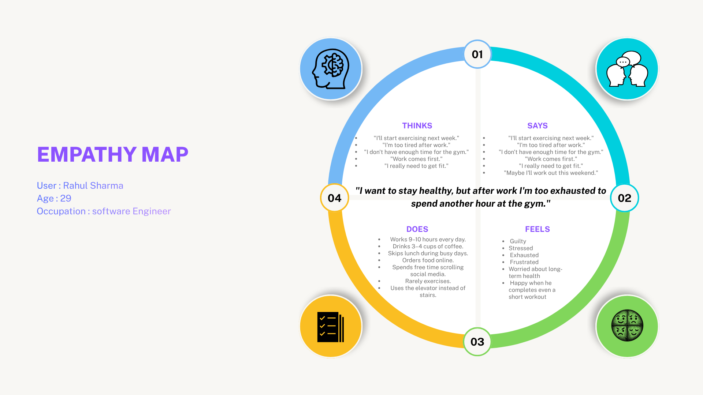
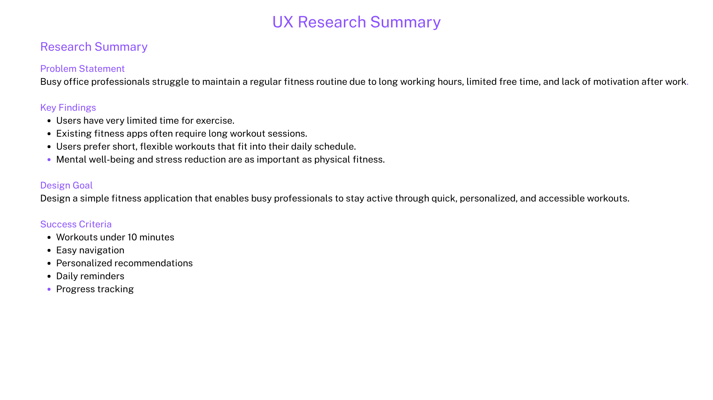

# 🏋️ Project 01 – Empathy Map

## 📖 Project Overview

This project focuses on understanding the needs, behaviors, and challenges of busy office professionals before designing a fitness application.

The UX research process includes:

- Target Audience Analysis
- User Persona
- Empathy Map
- User Research Summary

---

## 🎯 Objective

To understand users before designing the interface and identify their goals, frustrations, behaviors, and needs.

---

# 👥 Target Audience

---

# 👤 User Persona

---

# 🧠 Empathy Map

---

# 📑 User Research Summary

---

## 🛠️ Tools Used

- Canva
- UX Research
- User Persona
- Empathy Mapping

---

## 📚 Key Learning

This project helped me understand the importance of UX research before beginning the design process. By identifying the target audience, creating a user persona, and developing an empathy map, I gained insights into users' goals, pain points, motivations, and behaviors.

---

## 📄 Project PDF

[Download Project PDF](Project1.pdf)

---

## 👨‍💻 Author

**Priithve Kevati**
